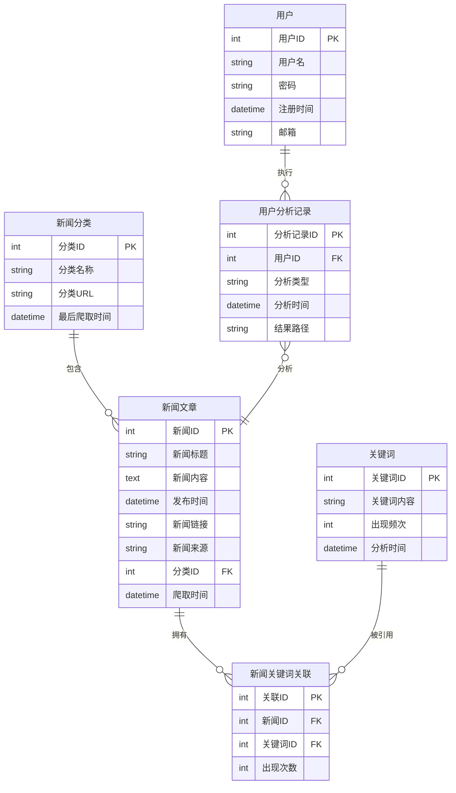

```mermaid
erDiagram
    用户 {
        int 用户ID PK
        string 用户名
        string 密码
        datetime 注册时间
        string 邮箱
    }
    
    新闻分类 {
        int 分类ID PK
        string 分类名称
        string 分类URL
        datetime 最后爬取时间
    }
    
    新闻文章 {
        int 新闻ID PK
        string 新闻标题
        text 新闻内容
        datetime 发布时间
        string 新闻链接
        string 新闻来源
        int 分类ID FK
        datetime 爬取时间
    }
    
    关键词 {
        int 关键词ID PK
        string 关键词内容
        int 出现频次
        datetime 分析时间
    }
    
    新闻关键词关联 {
        int 关联ID PK
        int 新闻ID FK
        int 关键词ID FK
        int 出现次数
    }
    
    用户分析记录 {
        int 分析记录ID PK
        int 用户ID FK
        string 分析类型
        datetime 分析时间
        string 结果路径
    }
    
    用户 ||--o{ 用户分析记录 : 执行
    新闻分类 ||--o{ 新闻文章 : 包含
    新闻文章 ||--o{ 新闻关键词关联 : 拥有
    关键词 ||--o{ 新闻关键词关联 : 被引用
    用户分析记录 }o--|| 新闻文章 : 分析
```