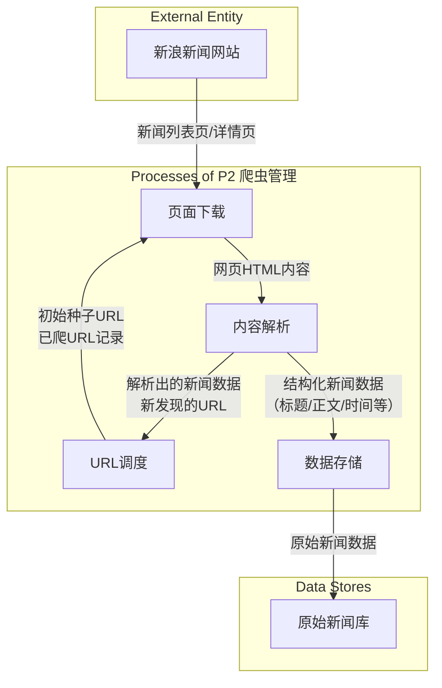

```mermaid
flowchart TD
    subgraph External Entity
        B[新浪新闻网站]
    end

    subgraph Data Stores
        D2[原始新闻库]
    end

    subgraph Processes of P2 爬虫管理
        P2_1[URL调度]
        P2_2[页面下载]
        P2_3[内容解析]
        P2_4[数据存储]
    end

    B -- "新闻列表页/详情页" --> P2_2

    P2_1 -- "初始种子URL<br>已爬URL记录" --> P2_2
    P2_2 -- "网页HTML内容" --> P2_3
    P2_3 -- "解析出的新闻数据<br>新发现的URL" --> P2_1
    P2_3 -- "结构化新闻数据<br>（标题/正文/时间等）" --> P2_4
    P2_4 -- "原始新闻数据" --> D2
```