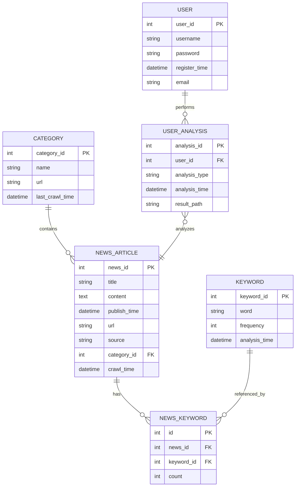

```mermaid
erDiagram
    USER {
        int user_id PK
        string username
        string password
        datetime register_time
        string email
    }
    
    CATEGORY {
        int category_id PK
        string name
        string url
        datetime last_crawl_time
    }
    
    NEWS_ARTICLE {
        int news_id PK
        string title
        text content
        datetime publish_time
        string url
        string source
        int category_id FK
        datetime crawl_time
    }
    
    KEYWORD {
        int keyword_id PK
        string word
        int frequency
        datetime analysis_time
    }
    
    NEWS_KEYWORD {
        int id PK
        int news_id FK
        int keyword_id FK
        int count
    }
    
    USER_ANALYSIS {
        int analysis_id PK
        int user_id FK
        string analysis_type
        datetime analysis_time
        string result_path
    }
    
    USER ||--o{ USER_ANALYSIS : performs
    CATEGORY ||--o{ NEWS_ARTICLE : contains
    NEWS_ARTICLE ||--o{ NEWS_KEYWORD : has
    KEYWORD ||--o{ NEWS_KEYWORD : referenced_by
    USER_ANALYSIS }o--|| NEWS_ARTICLE : analyzes
```